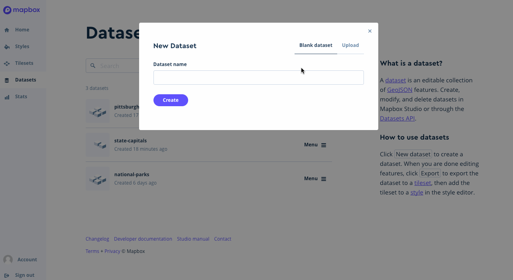
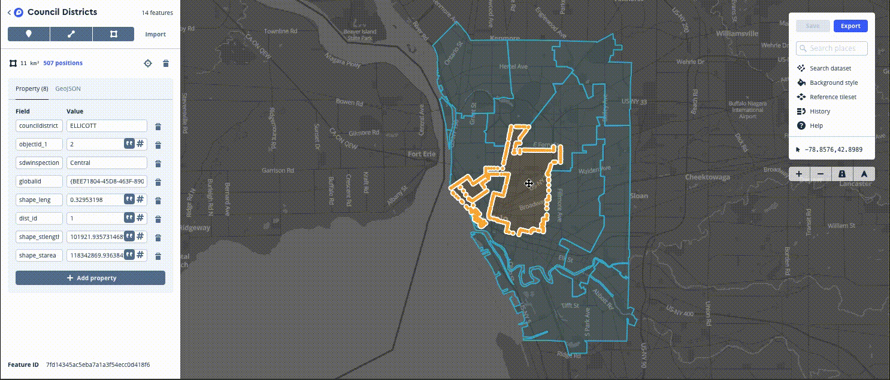
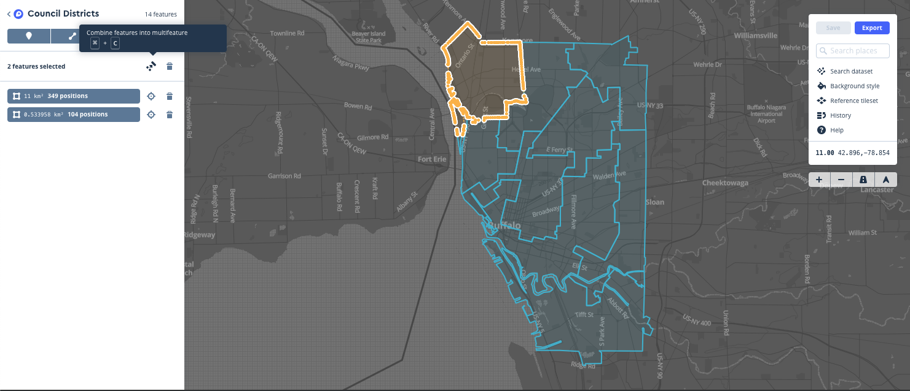

## Mapping rodent incidence by council district 

In this tutorial you will:

* Upload data as a dataset
* Draw & edit data with the dataset editor 
* Create centroid points in QGIS
* Upload data as a tileset 
* [Create a style](https://docs.mapbox.com/help/how-mapbox-works/map-design/#how-map-styles-work) for a basemap.
* [Manage and edit layers](https://www.mapbox.com/studio-manual/reference/styles/#style-editor) in your style
* [Add data](https://www.mapbox.com/help/uploads/) to a style
* Embed a map into a web page

## Software requirements

* Mapbox account
* QGIS
* Text editor 
* GitHub Account

## Data

## Uploading and editing datasets to Mapbox

You can use the Mapbox Studio [dataset editor](https://studio.mapbox.com/datasets/) to import, create, and edit point, line, and polygon features and their properties. A collection of these features in Mapbox is called a [dataset](https://docs.mapbox.com/help/glossary/dataset/). Datasets can either be downloaded as GeoJSON or exported to tilesets for use in Mapbox styles (see the [Introduction](https://docs.mapbox.com/studio-manual/overview/) section for more information). 

## [What is a dataset?](https://docs.mapbox.com/studio-manual/reference/datasets/#what-is-a-dataset)

A dataset is an editable collection of [GeoJSON](https://www.mapbox.com/help/define-geojson) features. Datasets are distinct from [tilesets](https://www.mapbox.com/help/define-tileset) in that datasets can be edited on a feature-by-feature basis, but cannot be used directly in [Mapbox Studio style editor](https://docs.mapbox.com/studio-manual/reference/styles/#style-editor).

To get started with this tutorial, you will need to go to the [dataset editor](https://studio.mapbox.com/datasets/) in Mapbox Studio and upload your District Council data. 

On your Datasets page, click the __Upload dataset__ button and select the District Council GeoJSON from your local drive. 

Explore your dataset by clicking on different polygons. What property values to see on the left side of the screen? 

Notice that there are multiple polygons with the same name - there are two polygons for district council 'North', two for 'Niagara' amd 4 polygon features for 'Lovejoy'. Before we continue with this exercise, we need to merge our polygon features. Let's start by selecting both of the 'North' district council polygons. Hold down the shift button to select both features at once. With both features selected, click on the __Combine features into multifeature__ button.

Repeat the steps above for both the 'Niagara' and 'Lovejoy' districts. 

You should now have a single polygon feature for each of the council districts. Next, we will add a new property field to each of our polygons. The new property field will contian information about the incidence of rodents in each district area. The following table contains information on the rodent incidence rate by district: 

| Council District | Incidence Rate |
|------------------|----------------|
| Delaware         | 1950           |
| Ellicott         | 1556           |
| Fillmore         | 2344           |
| Lovejoy          | 2278           |
| Masten           | 2319           |
| Niagara          | 2265           |
| North            | 1912           |
| South            | 2155           |
| University       | 1596           |

